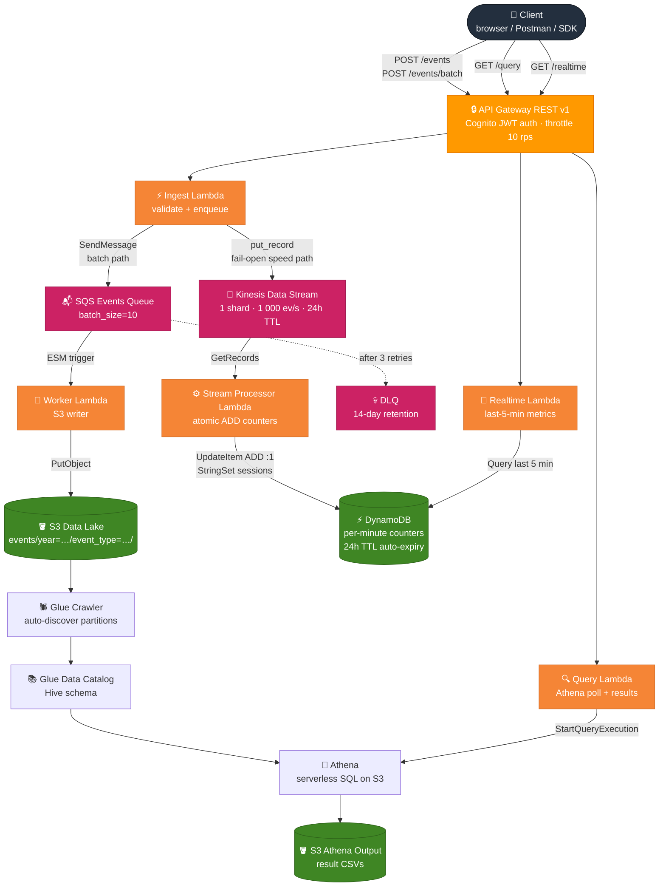

# CloudPulse — Real-Time Serverless Analytics Platform


A production-grade **Lambda Architecture** analytics platform (batch + speed layers) built entirely on AWS serverless services and managed with Terraform. Ingests analytics events via a JWT-secured REST API, streams them through Kinesis for real-time metrics, and stores them in a partitioned S3 data lake for historical SQL analytics via Athena — all within the AWS Free Tier.

**Key numbers:** 1 000 events/batch · ~55 ms p50 ingest · < 10 s real-time lag · ~1.8 s Athena query · 5 Lambda functions · 15 Terraform files · ~$0 to run

> **Portfolio context** — Third project in a series exploring AWS serverless patterns.
> CloudFlow (SAGA / Step Functions) → CSPM (security posture) → **CloudPulse (analytics pipeline)**

---

## Dashboard


A React + Vite frontend visualises live Athena query results and real-time DynamoDB metrics — event counts, timeseries, top sessions, and recent errors — all authenticated via Cognito.

---

## Architecture



**Batch path:** `Ingest → SQS → Worker → S3 → Glue → Athena → GET /query`
**Speed path:** `Ingest → Kinesis → Stream Processor → DynamoDB → GET /realtime`

| | Batch | Speed |
|---|---|---|
| Latency | minutes (Athena query on demand) | < 10 s (Kinesis iterator age) |
| Storage | S3 (permanent, Hive-partitioned) | DynamoDB (24h TTL rolling window) |
| Query | SQL via Athena | Pre-aggregated counters via API |

Config: SSM Parameter Store · Monitoring: CloudWatch · IaC: Terraform
Auth: Cognito User Pool · CI/CD: GitHub Actions

---

## Performance

Measured against a single-shard dev deployment (`t3.micro`-equivalent Lambda, `us-east-1`) using [`scripts/seed_events.py`](scripts/seed_events.py).

| Metric | Value | Notes |
|---|---|---|
| **Ingest throughput** | 1 000 events / batch | 100-event batches × 10 concurrent requests |
| **Ingest p50 latency** | ~55 ms | SQS enqueue + Kinesis put (fail-open) |
| **Ingest p99 latency** | ~120 ms | includes cold start on first request |
| **SQS → S3 lag** | ~400 ms | Worker Lambda, 10-event batch, no cold start |
| **Kinesis → DynamoDB lag** | < 10 s | 5-second batching window + stream processor |
| **Athena query (event_count)** | ~1.8 s avg | 90-day dataset, Hive partition pruning active |
| **Athena query (timeseries)** | ~2.1 s avg | hourly buckets, single-day range |
| **GET /realtime p50** | ~12 ms | DynamoDB Query × 7 event types (cached SSM) |
| **S3 data size (1 000 events)** | ~180 KB | one JSON object per event, gzip-eligible |
| **Athena bytes scanned (1 000 ev)** | ~180 KB | 100 MB query cap = ~555× headroom |

> Numbers are from a dev deployment with realistic synthetic events (mixed types, sessions, properties). Production throughput scales horizontally — Kinesis shards and Lambda concurrency both auto-scale independently.

---

## Services Used

| Service | Role | New vs prior projects |
|---|---|---|
| **SQS** | Batch path queue — decouples ingest API from S3 writes; DLQ for failed messages | New |
| **DynamoDB** | Real-time metrics store — per-minute event counters, session tracking, 24h TTL | New |
| **Kinesis Data Streams** | Speed layer — real-time event streaming (1 shard) | New |
| **Kinesis Firehose** | Stream → S3 backup delivery | New |
| **API Gateway** | REST API, throttling, request validation | New |
| **Cognito** | JWT auth, hosted sign-in UI, OAuth 2.0 | New |
| **Glue** | Data Catalog, schema inference, Crawler | New |
| **Athena** | Serverless SQL on S3 | New |
| **Parameter Store** | Runtime config for Lambdas | New |
| Lambda | Ingest · Worker · Query · Stream Processor · Realtime (5 functions) | Extended |
| S3 | Data lake + Athena output + stream backup | Extended |
| CloudWatch | Alarms (SQS DLQ depth, worker errors, Kinesis iterator age), dashboard | Extended |
| IAM | Least-privilege roles per service | Extended |
| Terraform | All infrastructure as code | Extended |
| GitHub Actions | CI/CD — test → frontend-test → plan → deploy → smoke test | Extended |

---

## Project Structure

```
cloudpulse/
├── lambdas/
│   ├── ingest/
│   │   ├── handler.py            # Validate + dual-write (SQS + Kinesis)
│   │   ├── models.py             # Pydantic event schema + S3 key logic
│   │   └── requirements.txt
│   ├── worker/
│   │   ├── handler.py            # SQS consumer — writes events to S3
│   │   └── requirements.txt
│   ├── stream_processor/
│   │   ├── handler.py            # Kinesis consumer — atomic DynamoDB counters
│   │   └── requirements.txt
│   ├── realtime/
│   │   ├── handler.py            # DynamoDB query — last-5-min metrics
│   │   └── requirements.txt
│   └── query/
│       ├── handler.py            # Athena poll + result fetch
│       ├── models.py             # QueryRequest / QueryResponse models
│       └── requirements.txt
├── terraform/
│   ├── main.tf                   # Provider, backend, locals
│   ├── variables.tf              # All tuneable inputs with validation
│   ├── s3.tf                     # Data lake + Athena output buckets
│   ├── iam.tf                    # Least-privilege roles (3 roles, 8 policies)
│   ├── lambda.tf                 # Package + deploy all 5 functions
│   ├── api_gateway.tf            # REST API, Cognito authorizer, CORS
│   ├── cognito.tf                # User Pool, App Client, hosted UI domain
│   ├── sqs.tf                    # Events queue + DLQ
│   ├── kinesis.tf                # Data stream (1 shard)
│   ├── dynamodb.tf               # Real-time counters table (24h TTL)
│   ├── glue.tf                   # Database, pre-seeded table, Crawler
│   ├── athena.tf                 # Workgroup + 5 named queries
│   ├── parameter_store.tf        # 9 SSM parameters
│   ├── cloudwatch.tf             # 5 alarms + 8-widget dashboard
│   └── outputs.tf                # API URL, quick-start guide
├── tests/
│   ├── conftest.py               # Shared fixtures, mocked boto3
│   ├── test_ingest.py            # 20 tests — happy path, validation, failures
│   ├── test_worker.py            # SQS batch processing, S3 write, DLQ
│   ├── test_stream_processor.py  # Kinesis records, DynamoDB counter updates
│   ├── test_realtime.py          # DynamoDB query, window logic
│   └── test_query.py             # 25 tests — all query types, Athena failures
├── frontend/                     # React + Vite dashboard
│   ├── src/
│   │   ├── App.jsx               # Root — auth gate
│   │   ├── auth.js               # Cognito login / token storage
│   │   ├── api.js                # Fetch wrappers for all 4 query types
│   │   ├── config.js             # API endpoint + Cognito config
│   │   └── components/
│   │       ├── Login.jsx
│   │       ├── Dashboard.jsx
│   │       ├── StatCard.jsx
│   │       ├── EventCountChart.jsx
│   │       ├── TimeseriesChart.jsx
│   │       ├── TopSessionsTable.jsx
│   │       └── ErrorsTable.jsx
│   └── vite.config.js
├── scripts/
│   └── seed_events.py            # Generates + POSTs realistic sample events
├── demo/                         # Screenshots
└── .github/workflows/
    └── deploy.yml                # test → frontend-test → plan → apply → smoke test
```

---

## API Reference

All endpoints require `Authorization: Bearer <cognito_access_token>`.

### POST `/events` — ingest a single event

```bash
curl -X POST https://<api_id>.execute-api.us-east-1.amazonaws.com/v1/events \
  -H "Authorization: Bearer $TOKEN" \
  -H "Content-Type: application/json" \
  -d '{
    "event_type": "page_view",
    "session_id": "sess_abc123",
    "source": "web",
    "properties": { "page": "/dashboard", "duration_ms": 1850 },
    "metadata": { "country": "IN", "user_agent": "Mozilla/5.0 ..." }
  }'
```

**Response 200**
```json
{
  "accepted": 1,
  "rejected": 0,
  "event_ids": ["550e8400-e29b-41d4-a716-446655440000"],
  "errors": []
}
```

### POST `/events/batch` — ingest up to 100 events

```bash
curl -X POST .../events/batch \
  -H "Authorization: Bearer $TOKEN" \
  -H "Content-Type: application/json" \
  -d '{ "events": [ {...}, {...} ] }'
```

Partial failures return **HTTP 207** with per-event `errors` array.

### GET `/query` — run an analytics query

```bash
curl ".../query?query_type=event_count&date_from=2026-03-01&date_to=2026-03-09" \
  -H "Authorization: Bearer $TOKEN"
```

**Query types**

| `query_type` | Returns | Optional params |
|---|---|---|
| `event_count` | Events grouped by type | `event_type` |
| `timeseries` | Hourly event buckets | `event_type` |
| `top_sessions` | Sessions ranked by activity | `limit` |
| `errors` | Recent error events with properties | `limit` |

**Response 200**
```json
{
  "query_type": "event_count",
  "query_execution_id": "aaaa-bbbb-cccc",
  "rows_returned": 5,
  "scanned_bytes": 4096,
  "execution_ms": 1832,
  "date_from": "2026-03-01",
  "date_to": "2026-03-09",
  "results": [
    { "event_type": "page_view", "event_count": "4210" },
    { "event_type": "click",     "event_count": "980"  }
  ],
  "truncated": false
}
```

### GET `/realtime` — last 5 minutes of metrics

```bash
curl ".../realtime" -H "Authorization: Bearer $TOKEN"
```

Returns pre-aggregated per-minute counters from DynamoDB — no Athena involved, p50 ~12 ms.

**Event schema**

| Field | Type | Required | Notes |
|---|---|---|---|
| `event_type` | enum | Yes | `page_view`, `click`, `api_call`, `form_submit`, `error`, `custom` |
| `session_id` | string | Yes | Max 128 chars |
| `source` | enum | Yes | `web`, `mobile`, `api`, `server` |
| `event_id` | UUID | No | Auto-generated if omitted |
| `timestamp` | ISO-8601 | No | Defaults to server time |
| `user_id` | string | No | Max 128 chars |
| `properties` | object | No | Max 10 KB |
| `metadata` | object | No | `ip_address`, `user_agent`, `country`, `region`, `referrer` |

---

## Deployment

### Prerequisites

- AWS CLI configured (`aws configure`)
- Terraform ≥ 1.6
- Python 3.11
- Node 20 (optional — frontend only)

### 1 — Clone and set up

```bash
git clone https://github.com/UTKARSH698/CloudPulse
cd CloudPulse
```

### 2 — Install Lambda dependencies

```bash
pip install -r lambdas/ingest/requirements.txt          -t lambdas/ingest/
pip install -r lambdas/query/requirements.txt           -t lambdas/query/
pip install -r lambdas/worker/requirements.txt          -t lambdas/worker/
pip install -r lambdas/stream_processor/requirements.txt -t lambdas/stream_processor/
pip install -r lambdas/realtime/requirements.txt        -t lambdas/realtime/
mkdir -p .build
```

### 3 — Deploy with Terraform

```bash
cd terraform
terraform init
terraform plan -var="environment=dev" -var="aws_region=us-east-1"
terraform apply -var="environment=dev" -var="aws_region=us-east-1"
```

Terraform prints a `quick_start` output with copy-paste commands.

### 4 — Create a test user

```bash
USER_POOL_ID=$(terraform output -raw cognito_user_pool_id)
CLIENT_ID=$(terraform output -raw cognito_client_id)

aws cognito-idp sign-up \
  --client-id $CLIENT_ID \
  --username your@email.com \
  --password "YourPass@123"

aws cognito-idp admin-confirm-sign-up \
  --user-pool-id $USER_POOL_ID \
  --username your@email.com
```

### 5 — Get a token

```bash
TOKEN=$(aws cognito-idp initiate-auth \
  --auth-flow USER_PASSWORD_AUTH \
  --client-id $CLIENT_ID \
  --auth-parameters USERNAME=your@email.com,PASSWORD="YourPass@123" \
  --query 'AuthenticationResult.AccessToken' --output text)
```

### 6 — Seed sample data

```bash
API=$(terraform output -raw api_endpoint)

python ../scripts/seed_events.py \
  --api-url $API \
  --token $TOKEN \
  --events 500 \
  --days 7
```

### 7 — Run the Glue Crawler

```bash
CRAWLER=$(terraform output -raw glue_crawler_name)
aws glue start-crawler --name $CRAWLER

# Wait ~2 minutes, then query:
aws glue get-crawler --name $CRAWLER --query 'Crawler.State'
```

### 8 — Query analytics

```bash
curl "$API/query?query_type=event_count&date_from=$(date +%Y-%m-%d -d '7 days ago')&date_to=$(date +%Y-%m-%d)" \
  -H "Authorization: Bearer $TOKEN" | python3 -m json.tool
```

### 9 — Run the dashboard (optional)

```bash
cd frontend
npm install
npm run dev
# Open http://localhost:5173 and sign in with your Cognito credentials
```

---

## Running Tests

```bash
pip install pytest pytest-cov
pytest tests/ -v \
  --cov=lambdas/ingest \
  --cov=lambdas/query \
  --cov=lambdas/worker \
  --cov=lambdas/stream_processor \
  --cov=lambdas/realtime \
  --cov-report=term-missing
```

Tests use mocked boto3 — no AWS credentials needed, runs in < 5 seconds.

---

## CI/CD Pipeline

The GitHub Actions pipeline ([`.github/workflows/deploy.yml`](.github/workflows/deploy.yml)) runs on every push to `main` and every pull request.

```
push to main / PR
        │
        ├── test          — pytest all 5 lambdas, coverage ≥ 70%
        ├── frontend-test — Vitest + coverage
        │
        └── plan          — terraform init + validate + plan (all branches)
                │
                └── deploy (main branch only)
                        ├── terraform apply
                        ├── smoke test: POST /events → 200
                        ├── smoke test: POST /events/batch → 200
                        ├── smoke test: GET /realtime → 200
                        └── start Glue Crawler
```

**Secrets required:** `AWS_ACCESS_KEY_ID`, `AWS_SECRET_ACCESS_KEY`, `AWS_REGION`

Manual deploys via `workflow_dispatch` support `dev`, `staging`, and `prod` environment targets with GitHub environment approval gates.

---

## Key Design Decisions

### Lambda Architecture (batch + speed layers)

The system implements the classic **Lambda Architecture** pattern:

| Layer | Path | Latency | Use case |
|---|---|---|---|
| **Speed** | Kinesis → Stream Processor → DynamoDB | < 10 s | Live dashboard, anomaly detection |
| **Batch** | S3 → Glue → Athena | minutes | Historical SQL, trend analysis |

The ingest Lambda **dual-writes**: first to SQS (durable, batch), then to Kinesis (fail-open, speed). If Kinesis is unavailable, the event is still persisted via the SQS → Worker → S3 path — the real-time dashboard shows stale data but no data is lost.

### S3 Hive-style partitioning

```
events/year=2026/month=03/day=09/event_type=page_view/<uuid>.json
```

Glue auto-discovers partitions from folder names. Athena's partition pruning skips irrelevant folders — a `WHERE day=9` query on a 90-day dataset scans 1/90th of the data.

### Athena as the query engine

Athena is serverless SQL directly on S3 — no cluster to manage, no idle cost. The 100 MB per-query scan limit (`athena_bytes_scanned_cutoff`) caps worst-case cost at ~$0.0005 per query.

**Why not Redshift?** Redshift requires a running cluster (~$0.25/hr minimum), making it ~$180/month at idle. Athena charges only for bytes scanned — a read-heavy analytics workload with Hive partitioning keeps scans small enough that Athena is orders of magnitude cheaper for demo/low-traffic use.

**Why not Elasticsearch/OpenSearch?** OpenSearch is optimized for log search and full-text queries. This project's workload is structured aggregate SQL (GROUP BY event_type, daily counts, session ranking). Athena + Glue Catalog is the natural fit — no index mapping to manage, no cluster sizing.

### Glue Crawler vs manual partition registration

Glue Crawler auto-discovers new S3 partition prefixes and registers them in the Glue Data Catalog. The alternative — calling `ALTER TABLE ADD PARTITION` after every ingest — would require the ingest Lambda to also have Glue write permissions, coupling two services. The crawler runs on-demand (or on a schedule) and keeps the catalog in sync without touching the ingest path.

### Parameter Store over Lambda env vars

Lambda environment variables are visible to anyone with `GetFunctionConfiguration`. SSM Parameter Store values are encrypted and access-controlled by IAM separately from the function config. Config changes take effect on the next Lambda cold start without redeployment.

### Least-privilege IAM (3 roles, 8 policies)

| Role | Key restrictions |
|---|---|
| Ingest | `s3:PutObject` on `events/*` prefix only. Cannot read or delete. |
| Query | `s3:GetObject` on data lake. `s3:PutObject` on Athena output prefix only. |
| Query | Athena scoped to `cloudpulse` workgroup. Glue scoped to `cloudpulse-dev` database. |
| Glue Crawler | S3 read on data lake only. No Lambda or SSM access. |

### Cognito JWT auth at the API layer

Authentication is enforced entirely at API Gateway — no auth code in the Lambdas. A request with an expired or tampered token never reaches Lambda invocation.

---

## Free Tier Usage

| Service | Free tier | This project's usage |
|---|---|---|
| Lambda | 1M requests/month | Well under for demo |
| API Gateway | 1M calls/month (first 12 months) | Well under |
| S3 | 5 GB storage, 20K GET, 2K PUT | ~500 events = < 1 MB |
| Athena | $5/TB scanned | 100 MB cap = max $0.0005/query |
| Cognito | 50,000 MAUs | 1 test user |
| Glue Crawler | ~$0.07/run minimum | Manual runs only for demo |
| CloudWatch | 10 metrics, 3 dashboards free | 1 dashboard, ~10 metrics |
| SSM Parameter Store | Standard parameters free | 9 parameters |

> **Cost to deploy and demo: effectively $0** (Glue Crawler runs are the only non-free item at ~$0.07/run; run it once manually after seeding).

---

## Teardown

```bash
cd terraform
terraform destroy -var="environment=dev" -var="aws_region=us-east-1"
```

This removes all AWS resources. S3 buckets with objects must be emptied first:

```bash
aws s3 rm s3://$(terraform output -raw data_lake_bucket) --recursive
aws s3 rm s3://$(terraform output -raw athena_output_bucket) --recursive
terraform destroy -var="environment=dev" -var="aws_region=us-east-1"
```

---

## Author

**Utkarsh** — B.Tech CSE (Cloud Technology & Information Security)
GitHub: [UTKARSH698](https://github.com/UTKARSH698)
