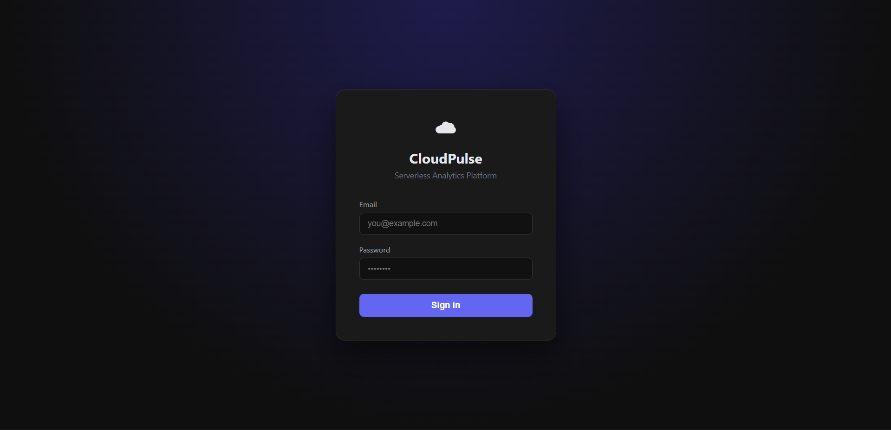
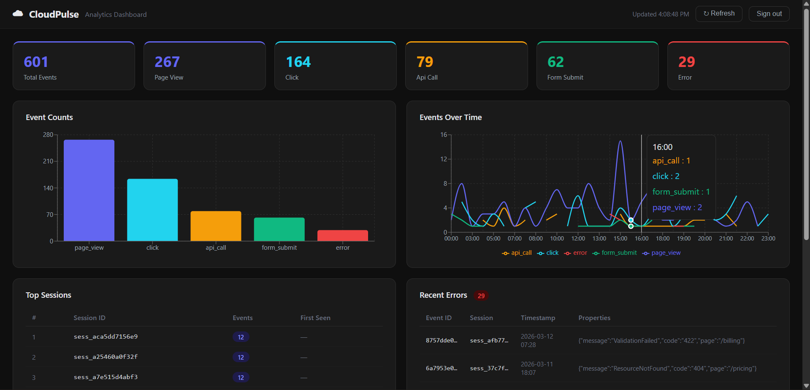

# CloudPulse — Serverless Analytics Platform

A production-grade, event-driven analytics pipeline built entirely on AWS serverless services and managed with Terraform. Ingests analytics events via a JWT-secured REST API, stores them in a partitioned S3 data lake, and makes them queryable through Athena SQL — all within the AWS Free Tier.

> **Portfolio context** — Third project in a series exploring AWS serverless patterns.
> CloudFlow (SAGA / Step Functions) → CSPM (security posture) → **CloudPulse (analytics pipeline)**

---

## Dashboard





A React + Vite frontend visualises live Athena query results — event counts, timeseries, top sessions, and recent errors — all authenticated via Cognito.

---

## Architecture

```
Client (browser / Postman / SDK)
        │
        │  POST /events          GET /query
        ▼
┌───────────────────────────────┐
│      API Gateway (REST)       │  ← Cognito JWT authorizer
│   throttle: 10 req/s burst 20 │  ← Usage plan guard
└──────────┬──────────┬─────────┘
           │          │
    ┌──────▼──┐  ┌────▼──────┐
    │ Ingest  │  │  Query    │   Lambda (Python 3.11 + Pydantic v2)
    │ Lambda  │  │  Lambda   │
    └──────┬──┘  └────┬──────┘
           │          │ start_query / poll / get_results
           │     ┌────▼──────┐
           │     │  Athena   │   SQL on S3, 100 MB scan limit
           │     └────┬──────┘
           │          │ reads schema
           │     ┌────▼──────┐
           │     │   Glue    │   Data Catalog (schema + partitions)
           │     │  Crawler  │   runs every 6 h or on-demand
           │     └────┬──────┘
           │          │
           ▼          ▼
    ┌──────────────────────────┐
    │     S3 Data Lake         │   Hive-partitioned JSON
    │  events/year=YYYY/       │   year / month / day / event_type
    │    month=MM/day=DD/      │
    │    event_type=page_view/ │
    └──────────────────────────┘

Config: Parameter Store   Monitoring: CloudWatch   IaC: Terraform   CI/CD: GitHub Actions
Auth:   Cognito User Pool
```

---

## Services Used

| Service | Role | New vs prior projects |
|---|---|---|
| **API Gateway** | REST API, throttling, request validation | New |
| **Cognito** | JWT auth, hosted sign-in UI, OAuth 2.0 | New |
| **Glue** | Data Catalog, schema inference, Crawler | New |
| **Athena** | Serverless SQL on S3 | New |
| **Parameter Store** | Runtime config for Lambdas | New |
| Lambda | Ingest + Query functions | Extended |
| S3 | Data lake + Athena output | Extended |
| CloudWatch | Alarms, dashboard, access logs | Extended |
| IAM | Least-privilege roles per service | Extended |
| Terraform | All infrastructure as code | Extended |
| GitHub Actions | CI/CD — test → plan → deploy → smoke test | Extended |

---

## Project Structure

```
cloudpulse/
├── lambdas/
│   ├── ingest/
│   │   ├── handler.py       # Lambda entry point
│   │   ├── models.py        # Pydantic event schema + S3 key logic
│   │   └── requirements.txt
│   └── query/
│       ├── handler.py       # Athena poll + result fetch
│       ├── models.py        # QueryRequest / QueryResponse models
│       └── requirements.txt
├── terraform/
│   ├── main.tf              # Provider, backend, locals
│   ├── variables.tf         # All tuneable inputs with validation
│   ├── s3.tf                # Data lake + Athena output buckets
│   ├── iam.tf               # Least-privilege roles (3 roles, 8 policies)
│   ├── lambda.tf            # Package + deploy both functions
│   ├── api_gateway.tf       # REST API, Cognito authorizer, CORS
│   ├── cognito.tf           # User Pool, App Client, hosted UI domain
│   ├── glue.tf              # Database, pre-seeded table, Crawler
│   ├── athena.tf            # Workgroup + 5 named queries
│   ├── parameter_store.tf   # 9 SSM parameters
│   ├── cloudwatch.tf        # 5 alarms + 8-widget dashboard
│   └── outputs.tf           # API URL, quick-start guide
├── tests/
│   ├── conftest.py          # Shared fixtures, mocked boto3
│   ├── test_ingest.py       # 20 tests — happy path, validation, S3 failures
│   └── test_query.py        # 25 tests — all query types, Athena failures
├── frontend/                # React + Vite dashboard
│   ├── src/
│   │   ├── App.jsx          # Root — auth gate
│   │   ├── auth.js          # Cognito login / token storage
│   │   ├── api.js           # Fetch wrappers for all 4 query types
│   │   ├── config.js        # API endpoint + Cognito config
│   │   └── components/
│   │       ├── Login.jsx
│   │       ├── Dashboard.jsx
│   │       ├── StatCard.jsx
│   │       ├── EventCountChart.jsx
│   │       ├── TimeseriesChart.jsx
│   │       ├── TopSessionsTable.jsx
│   │       └── ErrorsTable.jsx
│   └── vite.config.js
├── scripts/
│   └── seed_events.py       # Generates + POSTs realistic sample events
├── demo/                    # Screenshots and GIF demos
└── .github/workflows/
    └── deploy.yml           # test → plan → apply → smoke test
```

---

## API Reference

All endpoints require `Authorization: Bearer <cognito_access_token>`.

### POST `/events` — ingest a single event

```bash
curl -X POST https://<api_id>.execute-api.us-east-1.amazonaws.com/v1/events \
  -H "Authorization: Bearer $TOKEN" \
  -H "Content-Type: application/json" \
  -d '{
    "event_type": "page_view",
    "session_id": "sess_abc123",
    "source": "web",
    "properties": { "page": "/dashboard", "duration_ms": 1850 },
    "metadata": { "country": "IN", "user_agent": "Mozilla/5.0 ..." }
  }'
```

**Response 200**
```json
{
  "accepted": 1,
  "rejected": 0,
  "event_ids": ["550e8400-e29b-41d4-a716-446655440000"],
  "errors": []
}
```

### POST `/events/batch` — ingest up to 100 events

```bash
curl -X POST .../events/batch \
  -H "Authorization: Bearer $TOKEN" \
  -H "Content-Type: application/json" \
  -d '{ "events": [ {...}, {...} ] }'
```

Partial failures return **HTTP 207** with per-event `errors` array.

### GET `/query` — run an analytics query

```bash
curl ".../query?query_type=event_count&date_from=2026-03-01&date_to=2026-03-09" \
  -H "Authorization: Bearer $TOKEN"
```

**Query types**

| `query_type` | Returns | Optional params |
|---|---|---|
| `event_count` | Events grouped by type | `event_type` |
| `timeseries` | Hourly event buckets | `event_type` |
| `top_sessions` | Sessions ranked by activity | `limit` |
| `errors` | Recent error events with properties | `limit` |

**Response 200**
```json
{
  "query_type": "event_count",
  "query_execution_id": "aaaa-bbbb-cccc",
  "rows_returned": 5,
  "scanned_bytes": 4096,
  "execution_ms": 1832,
  "date_from": "2026-03-01",
  "date_to": "2026-03-09",
  "results": [
    { "event_type": "page_view", "event_count": "4210" },
    { "event_type": "click",     "event_count": "980"  }
  ],
  "truncated": false
}
```

**Event schema**

| Field | Type | Required | Notes |
|---|---|---|---|
| `event_type` | enum | Yes | `page_view`, `click`, `api_call`, `form_submit`, `error`, `custom` |
| `session_id` | string | Yes | Max 128 chars |
| `source` | enum | Yes | `web`, `mobile`, `api`, `server` |
| `event_id` | UUID | No | Auto-generated if omitted |
| `timestamp` | ISO-8601 | No | Defaults to server time |
| `user_id` | string | No | Max 128 chars |
| `properties` | object | No | Max 10 KB |
| `metadata` | object | No | `ip_address`, `user_agent`, `country`, `region`, `referrer` |

---

## Deployment

### Prerequisites

- AWS CLI configured (`aws configure`)
- Terraform ≥ 1.6
- Python 3.11

### 1 — Clone and set up

```bash
git clone https://github.com/UTKARSH698/CloudPulse
cd CloudPulse
```

### 2 — Install Lambda dependencies

```bash
pip install -r lambdas/ingest/requirements.txt -t lambdas/ingest/
pip install -r lambdas/query/requirements.txt  -t lambdas/query/
mkdir -p .build
```

### 3 — Deploy with Terraform

```bash
cd terraform
terraform init
terraform plan -var="environment=dev" -var="aws_region=us-east-1"
terraform apply -var="environment=dev" -var="aws_region=us-east-1"
```

Terraform prints a `quick_start` output with copy-paste commands.

### 4 — Create a test user

```bash
USER_POOL_ID=$(terraform output -raw cognito_user_pool_id)
CLIENT_ID=$(terraform output -raw cognito_client_id)

aws cognito-idp sign-up \
  --client-id $CLIENT_ID \
  --username your@email.com \
  --password "YourPass@123"

aws cognito-idp admin-confirm-sign-up \
  --user-pool-id $USER_POOL_ID \
  --username your@email.com
```

### 5 — Get a token

```bash
TOKEN=$(aws cognito-idp initiate-auth \
  --auth-flow USER_PASSWORD_AUTH \
  --client-id $CLIENT_ID \
  --auth-parameters USERNAME=your@email.com,PASSWORD="YourPass@123" \
  --query 'AuthenticationResult.AccessToken' --output text)
```

### 6 — Seed sample data

```bash
API=$(terraform output -raw api_endpoint)

python ../scripts/seed_events.py \
  --api-url $API \
  --token $TOKEN \
  --events 500 \
  --days 7
```

### 7 — Run the Glue Crawler

```bash
CRAWLER=$(terraform output -raw glue_crawler_name)
aws glue start-crawler --name $CRAWLER

# Wait ~2 minutes, then query:
aws glue get-crawler --name $CRAWLER --query 'Crawler.State'
```

### 8 — Query analytics

```bash
curl "$API/query?query_type=event_count&date_from=$(date +%Y-%m-%d -d '7 days ago')&date_to=$(date +%Y-%m-%d)" \
  -H "Authorization: Bearer $TOKEN" | python3 -m json.tool
```

### 9 — Run the dashboard (optional)

```bash
cd frontend
npm install
npm run dev
# Open http://localhost:5173 and sign in with your Cognito credentials
```

---

## Running Tests

```bash
pip install pytest pytest-cov
pytest tests/ -v --cov=lambdas/ingest --cov=lambdas/query --cov-report=term-missing
```

Tests use mocked boto3 — no AWS credentials needed, runs in < 5 seconds.

---

## Key Design Decisions

### S3 Hive-style partitioning

```
events/year=2026/month=03/day=09/event_type=page_view/<uuid>.json
```

Glue auto-discovers partitions from folder names. Athena's partition pruning skips irrelevant folders — a `WHERE day=9` query on a 90-day dataset scans 1/90th of the data.

### Athena as the query engine

Athena is serverless SQL directly on S3 — no cluster to manage, no idle cost. The 100 MB per-query scan limit (`athena_bytes_scanned_cutoff`) caps worst-case cost at ~$0.0005 per query.

### Parameter Store over Lambda env vars

Lambda environment variables are visible to anyone with `GetFunctionConfiguration`. SSM Parameter Store values are encrypted and access-controlled by IAM separately from the function config. Config changes take effect on the next Lambda cold start without redeployment.

### Least-privilege IAM (3 roles, 8 policies)

| Role | Key restrictions |
|---|---|
| Ingest | `s3:PutObject` on `events/*` prefix only. Cannot read or delete. |
| Query | `s3:GetObject` on data lake. `s3:PutObject` on Athena output prefix only. |
| Query | Athena scoped to `cloudpulse` workgroup. Glue scoped to `cloudpulse-dev` database. |
| Glue Crawler | S3 read on data lake only. No Lambda or SSM access. |

### Cognito JWT auth at the API layer

Authentication is enforced entirely at API Gateway — no auth code in the Lambdas. A request with an expired or tampered token never reaches Lambda invocation.

---

## Free Tier Usage

| Service | Free tier | This project's usage |
|---|---|---|
| Lambda | 1M requests/month | Well under for demo |
| API Gateway | 1M calls/month (first 12 months) | Well under |
| S3 | 5 GB storage, 20K GET, 2K PUT | ~500 events = < 1 MB |
| Athena | $5/TB scanned | 100 MB cap = max $0.0005/query |
| Cognito | 50,000 MAUs | 1 test user |
| Glue Crawler | ~$0.07/run minimum | Manual runs only for demo |
| CloudWatch | 10 metrics, 3 dashboards free | 1 dashboard, ~10 metrics |
| SSM Parameter Store | Standard parameters free | 9 parameters |

> **Cost to deploy and demo: effectively $0** (Glue Crawler runs are the only non-free item at ~$0.07/run; run it once manually after seeding).

---

## Demo

| Demo | Shows |
|---|---|
| `demo/dashboard.png` | React dashboard — live Athena query results |
| `demo-01-ingest.gif` | POST /events → 200, event in S3 |
| `demo-02-batch.gif` | POST /events/batch → accepted/rejected counts |
| `demo-03-query.gif` | GET /query → Athena results in < 2 s |

---

## Author

**Utkarsh** — B.Tech CSE (Cloud Technology & Information Security)
GitHub: [UTKARSH698](https://github.com/UTKARSH698)
